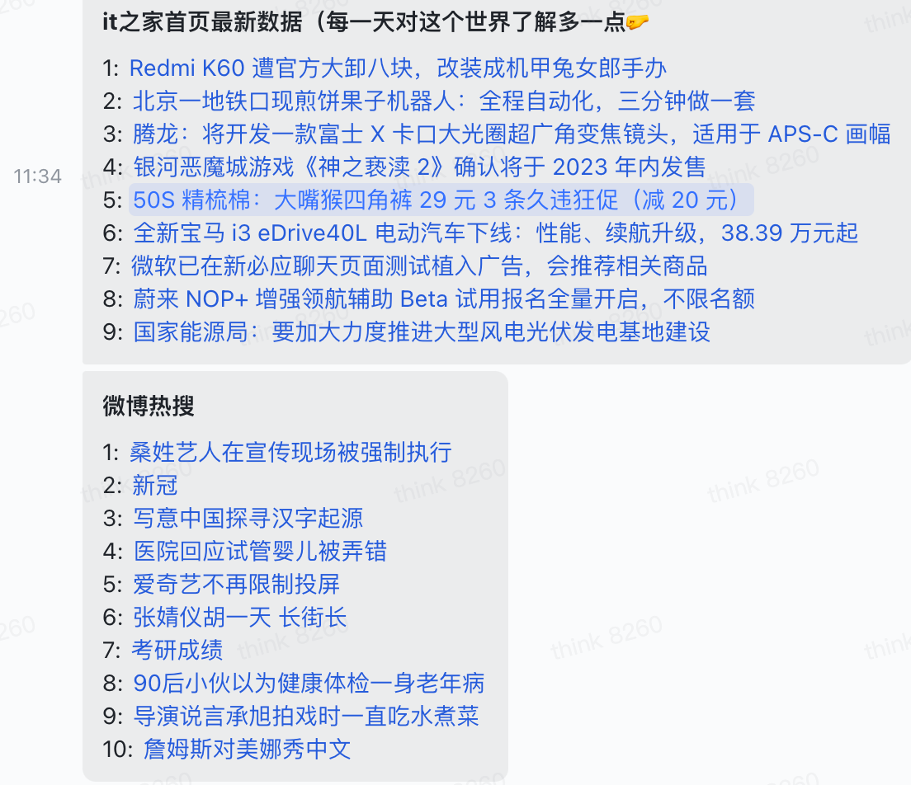

### 介绍
通过这个项目熟悉一下 **飞书机器人** 的大致使用，顺带练手一下定时任务，最简单的应用场景大概就是平常各类的打卡提醒了, 当然最主要的功能还是告警通知、会话互动... 慢慢拓展

### 运行命令
```
npm start
```
or
```
nodemon index.ts
```
### 目录结构
在根目录的 indexjs 中还放了一些使用的示例

通过 ```tree > tree.text``` 生成
```
├── config
│   ├── index.js // baseUrl 及一些账号的参数配置
│   └── local.js // 避免泄漏真实地址导致的恶意调用，没上传
├── images // 存放md引用的示例图片
│   ├── afternoon.png
│   ├── morning.jpg
│   └── night.png
├── index.js // 存放了一些示例
├── package-lock.json
├── package.json
├── readme.md
├── request
│   ├── index.js // 网络请求的简单封装
├── utils
│   ├── index.js // 发送消息的封装
│   └── timing.js // 定时任务的方法
│   └── itzj.js // it之家首页最新信息的推送
│   └── weibo.js // 更新微博热搜 
└── worker
    └── index.js // 定时运行定时任务
```
### 定时任务
早上天气预报

[https://www.tianqiapi.com/index/doc?version=day](https://www.tianqiapi.com/index/doc?version=day)

```
https://www.yiketianqi.com/free/day?appid=appid&appsecret=appsecret&unescape=1&cityid=101210101

```


中午干饭提醒
晚上下班提醒
```
*  *  *  *  *  *
┬  ┬  ┬  ┬  ┬  ┬
│  │  │  │  │  |
│  │  │  │  │  └ 星期几，取值：0 - 7，其中 0 和 7 都表示是周日
│  │  │  │  └─── 月份，取值：1 - 12
│  │  │  └────── 日期，取值：1 - 31
│  │  └───────── 时，取值：0 - 23
│  └──────────── 分，取值：0 - 59
└─────────────── 秒，取值：0 - 59（可选）
```
### 实现效果




### 上传图片
首先通过接口查询**app_access_token** 

https://open.feishu.cn/open-apis/auth/v3/app_access_token/internal

然后注意要开通上传图片的权限最后调用上传图片的接口拿到**image_key**

https://open.feishu.cn/open-apis/im/v1/images